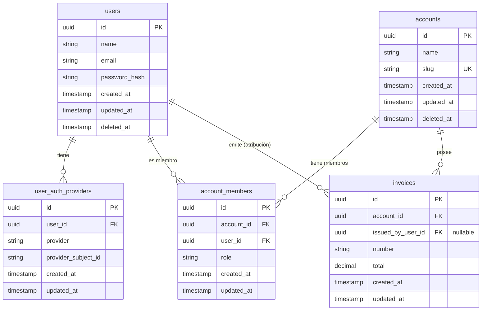

# Cuentas y propiedad de los datos (multi-tenancy)

Este documento recoge el requisito de producto y técnico: **la Cuenta (empresa/tenant) es la dueña de los datos**, y cómo afecta al comportamiento de la API y al filtrado.

---

## Concepto

| Entidad           | Rol                                                                                                                                 |
|-------------------|-------------------------------------------------------------------------------------------------------------------------------------|
| **User**          | La persona (identidad). Puede pertenecer a varias Cuentas. Dentro de una Cuenta, los datos pueden estar asociados al User (quién emitió una factura, quién creó un recurso, etc.) para trazabilidad y filtrado. |
| **Account**       | Empresa/tenant en el SaaS. **Dueña de los datos.** Todos los datos de negocio (proyectos, recursos, facturación, etc.) pertenecen a una Cuenta, no al User. Dentro de esa segmentación, muchos recursos tienen además un **usuario responsable** (ej. emisor de factura, creador de proyecto). |
| **Miembros**      | Usuarios vinculados a una Cuenta (p. ej. con un rol). Cualquier miembro puede actuar en nombre de la Cuenta dentro de sus permisos. |

**Principio:** Los datos son propiedad de la **Cuenta**. Al atender una petición, la API debe **filtrar por Cuenta** y, dentro de esa Cuenta, **tener en cuenta al User**: quién realiza la acción, roles y permisos, y la asociación usuario–recurso (quién emitió, creó o modificó). El filtrado combina **Cuenta + User/rol** según el caso.

---

## Proveedores de autenticación

La **identidad (User)** es única con independencia de cómo haya iniciado sesión. La API puede soportar varios **proveedores de autenticación**; todos confluyen en la misma entidad User y en el mismo flujo de Cuenta y membresía.

### Tipos de proveedor

| Proveedor | Descripción | Estado en esta API |
|-----------|-------------|--------------------|
| **Email/contraseña** | Registro en la API con email y contraseña; la API almacena `password_hash` y valida con bcrypt. | **Implementado.** Login en `POST /auth/login`, registro en `POST /users`. |
| **OAuth / login social** | El usuario inicia sesión con un proveedor externo (Google, GitHub, etc.). El proveedor devuelve un token o código; la API verifica la identidad y asocia o crea el User. | **Planeado.** Se almacenará en BD el proveedor y el identificador externo (tabla `user_auth_providers`); ver esquema más abajo. |

### Cómo encaja con el modelo actual

1. **Un User, una identidad**  
   Tanto si el usuario se registra con email/contraseña como si lo hace con Google (en el futuro), el resultado es **un mismo User** en la base de datos. No hay “dos usuarios” por persona; hay una sola fila en `users` vinculada a uno o más proveedores mediante la tabla `user_auth_providers` (proveedor + identificador externo).

2. **Mismo flujo tras el login**  
   Una vez autenticado (por el proveedor que sea), el usuario recibe el mismo tipo de **JWT** y el middleware pone en contexto el mismo **userID** (y email). A partir de ahí, el comportamiento es idéntico:
   - Si no tiene Cuenta → el cliente debe guiar al wizard (crear Account + AccountMember).
   - Si tiene Cuenta(s) → el cliente envía `account_id` (o slug) y la API filtra por Cuenta y valida membresía.

3. **Onboarding independiente del proveedor**  
   El wizard descrito más abajo (registro → crear Account → usar la app en contexto de Cuenta) se aplica **igual** para usuarios que llegaron por email/contraseña o por OAuth. El paso 1 es “obtener una sesión válida (User identificado)”; los pasos 2 y 3 (crear Account, usar la app con Cuenta) son los mismos.

4. **Resumen de conexión**  
   - **Proveedor de autenticación** = *cómo* se obtiene la identidad (email/password hoy; OAuth mañana).  
   - **User** = la identidad única; no depende del proveedor.  
   - **Account / AccountMember** = dueña de los datos y membresía; se crean y usan **después** de la autenticación, con la misma lógica para todos los proveedores.

5. **Requisito: almacenar proveedores en base de datos**  
   La API debe **almacenar en base de datos** los proveedores de autenticación vinculados a cada User. Así se permite:
   - Vincular la misma identidad (User) a varios proveedores (p. ej. email y Google).
   - En sucesivos logins (OAuth o email), resolver de forma unívoca qué User corresponde a un par `proveedor + identificador externo`.
   - Evitar que un mismo identificador externo (p. ej. `sub` de Google) se asocie a más de un User (unicidad por proveedor + identificador).

Con esto, “proveedores de autenticación” queda acotado a la capa de **login/registro**; el resto del documento (propiedad de datos, contexto de petición, wizard, filtrado por Cuenta) se mantiene y aplica por igual a todos ellos.

---

## Implicaciones

1. **Aislamiento de datos**  
   Todo recurso que sea “dato de negocio” (proyectos, ítems, suscripciones, etc.) debe estar asociado a una **Cuenta** (p. ej. `account_id`). Las consultas y respuestas deben estar siempre acotadas a una sola Cuenta.

2. **Contexto de la petición**  
   Cuando un miembro envía una petición desde el cliente:
   - La petición va ligada a **una Cuenta** (p. ej. claim en JWT `account_id`, header `X-Account-ID`, o workspace elegido en la app).
   - El backend debe **filtrar todas las lecturas y escrituras** por esa Cuenta y, cuando aplique, por el **User** (roles, quién emitió/creó el recurso):
     - **Lectura:** devolver solo datos de esa Cuenta; las listas y filtros pueden acotar además por usuario (ej. “facturas emitidas por este usuario”) o por rol.
     - **Escritura:** crear/actualizar/borrar solo dentro de esa Cuenta (y comprobar membresía/rol); asociar al User cuando corresponda (ej. `issued_by_user_id` en una factura).

3. **Autorización**  
   - Autenticar al **User** (quién hace la petición).  
   - Resolver el **Account** (cuenta) del request.  
   - Comprobar que el User es **miembro** de esa Cuenta (y opcionalmente el rol).  
   - Aplicar las reglas de acceso: **solo datos de esa Cuenta**, y cuando el recurso o la operación lo exijan, **considerar al User** (roles, atribución, filtros por “mis facturas”, “recursos que creé”, etc.).

4. **Usuarios con varias cuentas**  
   Un User puede ser miembro de varias Cuentas. El cliente (p. ej. Next.js) debe:
   - Permitir **elegir la Cuenta/workspace actual**.
   - Enviar ese contexto de Cuenta en cada petición (p. ej. en el token o en un header).  
   La API no “elige” la Cuenta; la **valida** y **filtra por ella**.

---

## Resumen

- **Account = tenant/empresa = dueña de los datos.**  
- **Filtrar por Cuenta** en toda petición y, dentro de esa Cuenta, **tener en cuenta al User**: roles, quién emitió/creó el recurso, y filtros por usuario cuando aplique (ej. facturas emitidas por un usuario concreto).  
- El **contexto de la petición** incluye Cuenta (y opcionalmente User); el backend valida membresía, acota por Cuenta y aplica reglas que combinan Cuenta + User/rol según el recurso.  
- Los recursos de negocio pueden llevar **atribución a usuario** (ej. `issued_by_user_id`) sin cambiar la propiedad: la factura es de la Cuenta; el User indica quién la emitió.  
- Este README es el placeholder del requisito; la implementación (modelos, middleware, scoping) vendrá después.

---

## Esquema de base de datos (modelo entidad-relación)

A continuación se describe cómo se traduce el modelo conceptual en tablas y relaciones. Parte del esquema ya existe (`users`, `refresh_tokens`); el resto es objetivo de diseño para la implementación de multi-tenancy.

### Entidades y atributos

| Entidad | Tabla | Atributos principales | Notas |
|--------|--------|------------------------|--------|
| **User** | `users` | `id` (PK), `name`, `email`, `password_hash`, `created_at`, `updated_at`, `deleted_at` | Identidad de la persona. Ya implementado. La vinculación con proveedores (email, OAuth) se hace vía `user_auth_providers`. |
| **UserAuthProvider** | `user_auth_providers` | `id` (PK), `user_id` (FK), `provider`, `provider_subject_id`, `created_at`, `updated_at` | Un User puede tener varios proveedores. UNIQUE(provider, provider_subject_id). Para email se usa el propio email como `provider_subject_id`; para OAuth, el `sub` (o equivalente) del proveedor. |
| **Account** | `accounts` | `id` (PK), `name`, `slug` (único), `created_at`, `updated_at`, `deleted_at` | Tenant/empresa; dueña de los datos. |
| **AccountMember** | `account_members` | `id` (PK), `account_id` (FK), `user_id` (FK), `role`, `created_at`, `updated_at` | Relación N:M User–Account con rol. UNIQUE(account_id, user_id). |
| **Recurso de negocio** (ej. factura, proyecto) | p. ej. `invoices` | `id` (PK), `account_id` (FK, NOT NULL), `issued_by_user_id` (FK, nullable), … | Todo recurso de negocio tiene `account_id`; opcionalmente un usuario responsable. |

### Relaciones

- **User → UserAuthProvider:** uno a muchos. Cada User puede tener varias filas en `user_auth_providers` (email, google, github, etc.). La combinación (provider, provider_subject_id) es única globalmente para resolver la identidad en el login.
- **User ↔ Account:** muchos a muchos, a través de `account_members`. Un User puede pertenecer a varias Accounts; una Account tiene muchos Users (miembros).
- **Account → Recursos de negocio:** uno a muchos. Cada recurso (proyecto, factura, ítem, etc.) pertenece a una sola Account (`account_id`).
- **User → Recursos de negocio (atribución):** opcional. Campos como `issued_by_user_id`, `created_by_user_id` indican quién realizó la acción dentro de la Account; la propiedad del dato sigue siendo de la Account.

### Diagrama entidad-relación (Mermaid)



*Nota: `invoices` es un ejemplo de recurso de negocio; el mismo patrón aplica a proyectos, ítems, suscripciones, etc.: `account_id` obligatorio y, si aplica, FKs de atribución a usuario.*

---

## Wizard de configuración (onboarding) — Comportamiento de la API

En este proyecto la API REST se diseña para que **nunca se considere válido un contexto sin Cuenta**: tras el registro del User, el siguiente paso lógico es crear la Account y el AccountMember. La API debe exponer los endpoints y las respuestas necesarias para que un cliente (p. ej. un frontend) pueda implementar un flujo tipo wizard (estilo Slack/Asana) y dejar los datos siempre asociados a una Cuenta desde el primer uso.

### Flujo que la API debe soportar

| Paso | Qué hace el cliente | Comportamiento / endpoints de esta API |
|------|---------------------|----------------------------------------|
| **1** | Registro o login (email/contraseña; en el futuro también OAuth/login social). | La API identifica o crea el **User** (identidad). Aún no hay Account. Ver [Proveedores de autenticación](#proveedores-de-autenticación). |
| **2** | Envía nombre del equipo/empresa (un solo campo). | La API crea la **Account** (nombre + slug) y el **AccountMember** vinculando User ↔ Account con rol por defecto (ej. `owner` o `admin`). |
| **3** | Usa la app con una Cuenta activa. | El cliente envía en cada petición el `account_id` (o slug). La API valida membresía y filtra por esa Cuenta. |

El mínimo viable que la API debe permitir es: **registro de User → creación de Account + AccountMember → uso de recursos siempre en contexto de Cuenta**.

### Por qué este diseño en la API

- **Account desde el inicio:** La API no expone un estado "usuario sin Cuenta" para uso normal; el endpoint de creación de Account en onboarding deja al User con al menos una Account. Todo recurso de negocio se crea bajo una Account.
- **Slug desde el primer recurso:** La Account se crea con nombre y slug únicos; la API puede usar el slug en rutas o en identificadores de workspace.
- **Un solo camino:** No hace falta un flujo alternativo "crear cuenta después" a nivel de API; el endpoint de creación de Account en contexto de onboarding es el camino estándar para usuarios recién registrados.
- **Escalable:** Si más adelante el User pertenece a varias Cuentas, la API ya filtra por `account_id`; el cliente solo necesita un selector de workspace.

### Contrato de la API (endpoints y respuestas)

1. **Estado “onboarding incompleto”**  
   Si el User existe pero no tiene ninguna Account (no hay fila en `account_members`), **esta API** debe indicarlo para que el cliente pueda redirigir al paso de creación de Account. Opciones: campo `onboarding_complete: false` en la respuesta de `GET /users/me` (o equivalente), o un claim en el JWT. El cliente decide la redirección; la API solo expone el estado.

2. **Creación de Account (onboarding)**  
   Un endpoint en **esta API**, por ejemplo `POST /accounts` (o `POST /onboarding/account` si se quiere separar), que:
   - Acepta en el body `name` (y opcionalmente `slug` si se permite custom).
   - Crea la Account en DB.
   - Crea el AccountMember con el `user_id` del JWT y rol por defecto (ej. `owner`).
   - Responde con la Account creada (incluyendo `id` y `slug`). El cliente usa ese `account_id` (o slug) como contexto en las siguientes peticiones.

3. **Slug**  
   La API genera el slug a partir del nombre (lowercase, sin espacios, caracteres no alfanuméricos reemplazados o eliminados). Si el slug ya existe, se añade sufijo (ej. `acme`, `acme-2`). La unicidad se garantiza en DB (`accounts.slug` UNIQUE).

4. **Varias Cuentas (más adelante)**  
   La invitación a otra Account se traduce en crear un nuevo AccountMember (endpoint que se defina en esta API). El wizard solo garantiza **al menos una** Account tras el registro; el resto (cambiar de workspace, listar Cuentas del User) sigue el mismo modelo de “Contexto de la petición” y “Usuarios con varias cuentas” de este documento.

### Resumen del flujo (vista API)

```
Cliente: registro → API crea User
       ↓
Cliente: "nombre del equipo" → API: POST /accounts (o /onboarding/account) → Account + AccountMember creados
       ↓
Cliente: peticiones con account_id/slug → API filtra por Cuenta y valida membresía
```

Con esto, el comportamiento de **esta API REST** y el modelo de datos (Account como dueña de los datos, User como identidad, AccountMember como relación) quedan alineados desde el primer uso.
