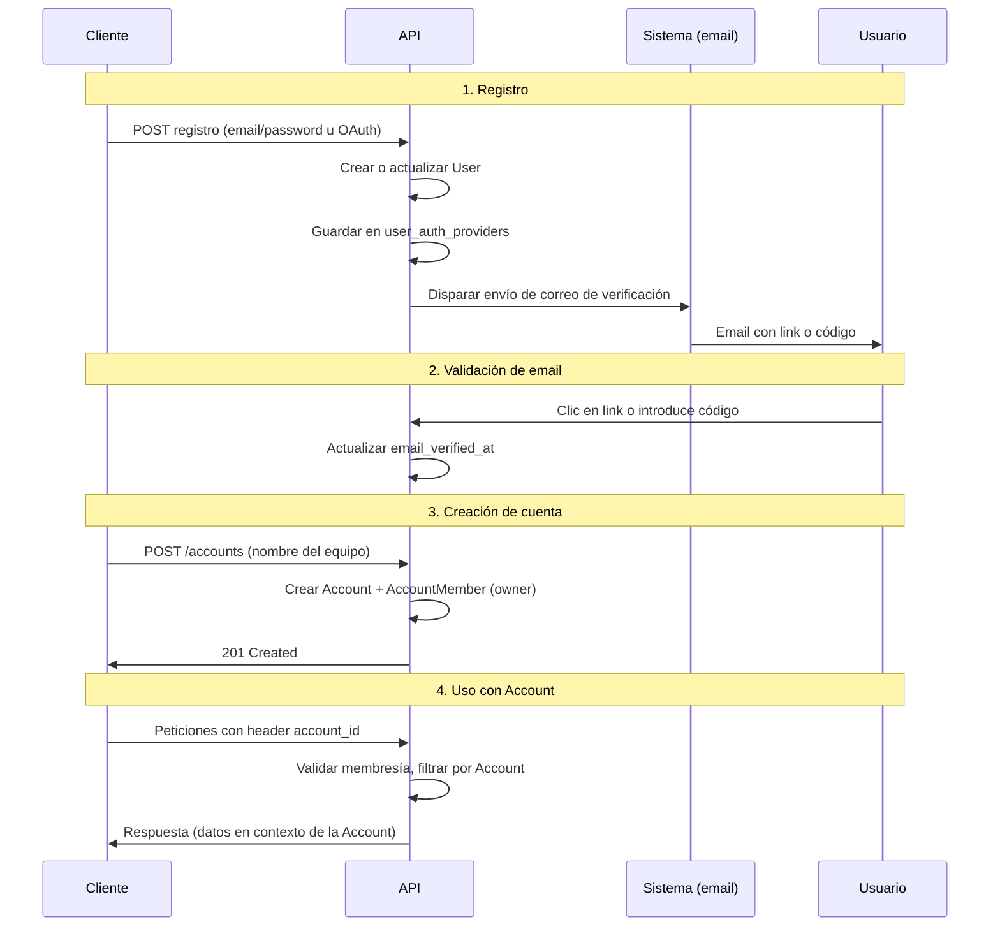
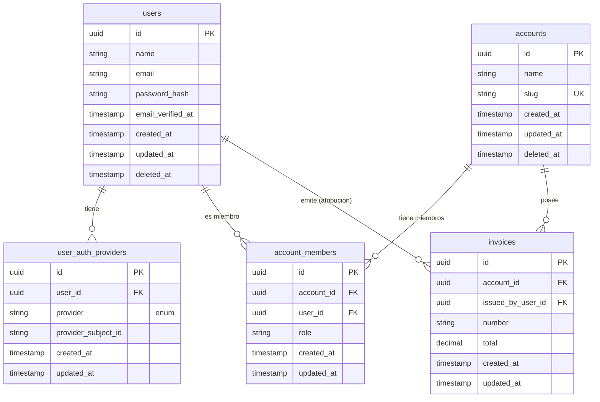

# Cuentas y propiedad de los datos

**Account** (cuenta/tenant) es la **dueña de los datos**. **User** es la identidad de la persona; puede pertenecer a varias Accounts. Toda la API filtra por Account y, cuando aplica, por User (roles, quién creó/emitió).

---

## 1. Registro de usuario (paso a paso)

Al registrarse, la API debe:

1. **Recibir datos del proveedor de autenticación**  
   No solo los que envía el cliente en el body: también los que devuelve el proveedor (email/contraseña hoy; OAuth mañana). Ejemplos: email, nombre, y para OAuth el `sub` (identificador externo) y el nombre del proveedor.

2. **Crear o vincular el User**  
   - Si es registro nuevo: crear fila en `users` con name, email (normalizado), y si aplica `password_hash`.  
   - Guardar el **proveedor** en `user_auth_providers`: `provider` (ej. `email`, `google`) y `provider_subject_id` (email para email; `sub` para OAuth). Así una misma identidad (User) puede tener varios proveedores y el login resuelve unívocamente.

3. **Obligar la validación de correo**  
   Tras el registro, el usuario **debe validar su correo electrónico** antes de poder completar el onboarding o usar la app con normalidad. La API:
   - Envía (o dispara) el correo de verificación con link o código.
   - Mantiene un estado de “email no verificado” (p. ej. `email_verified_at` en `users` o tabla de verificaciones).
   - No considera el onboarding completo ni permite crear Account hasta que el email esté verificado (o según política: bloquear todo hasta verificación).

**Resumen:** Registro = datos del cliente **+** datos del proveedor → crear/actualizar User y `user_auth_providers` → enviar verificación → usuario debe validar email.

---

## 2. Creación de la cuenta (paso a paso)

Solo cuando el User existe y (según política) **ha verificado su email**:

1. **Cliente envía nombre del equipo/empresa**  
   Ej. `POST /accounts` o `POST /onboarding/account` con `name` (y opcionalmente `slug`).

2. **API crea Account y AccountMember**  
   - Crea la Account (nombre + slug único).  
   - Crea AccountMember vinculando el `user_id` del JWT con la Account y rol por defecto (ej. `owner`).

3. **Cliente usa la app en contexto de Cuenta**  
   En cada petición envía `account_id` (o slug). La API valida membresía y filtra todo por esa Account.

---

## 3. Flujo de la API (resumen)

El flujo completo es: **Registro → Validación de email → Crear cuenta → Uso con Account**.

### Diagrama de secuencia del registro (Mermaid)

| Paso | Quién | Qué hace la API |
|------|--------|------------------|
| 1 | Cliente | Registro (email/password u OAuth). | Crea/actualiza User; guarda proveedor en `user_auth_providers`. |
| 2 | Sistema | — | Envía correo de verificación. Usuario debe validar. |
| 3 | Cliente | Envía nombre del equipo (crear cuenta). | Crea Account + AccountMember (solo si email verificado). |
| 4 | Cliente | Peticiones con `account_id`. | Valida membresía; filtra por Account (y User cuando aplique). |

---

## 4. Modelo entidad-relación (base de datos)

### Entidades y atributos

| Entidad | Tabla | Atributos principales | Notas |
|--------|--------|------------------------|--------|
| **User** | `users` | `id` (PK), `name`, `email`, `password_hash`, `email_verified_at` (opcional), `created_at`, `updated_at`, `deleted_at` | Identidad. Vinculación con proveedores vía `user_auth_providers`. |
| **UserAuthProvider** | `user_auth_providers` | `id` (PK), `user_id` (FK), `provider`, `provider_subject_id`, `created_at`, `updated_at` | `provider` es enum (google, facebook, credentials, …). UNIQUE(provider, provider_subject_id). |
| **Account** | `accounts` | `id` (PK), `name`, `slug` (único), `created_at`, `updated_at`, `deleted_at` | Tenant; dueña de los datos. |
| **AccountMember** | `account_members` | `id` (PK), `account_id` (FK), `user_id` (FK), `role`, `created_at`, `updated_at` | UNIQUE(account_id, user_id). |
| **Recurso de negocio** | p. ej. `invoices` | `id` (PK), `account_id` (FK), `issued_by_user_id` (FK, nullable), … | Siempre `account_id`; opcional atribución a User. |

### Relaciones

- **User → UserAuthProvider:** 1:N. Un User puede tener varios proveedores (email, google, etc.).
- **User ↔ Account:** N:M mediante `account_members`.
- **Account → Recursos:** 1:N. Todo recurso tiene `account_id`.
- **User → Recursos (atribución):** opcional (`issued_by_user_id`, etc.); la propiedad es de la Account.

### Diagrama ER (Mermaid)

**Nota:** En `user_auth_providers`, el campo `provider` es un **enum** con valores: `google`, `facebook`, `credentials`, etc.

---

## 5. Contexto de petición y autorización

- **Autenticación:** identificar al User (JWT).
- **Contexto de Cuenta:** el cliente envía `account_id` (o slug) en header o token; la API **valida membresía** y **filtra todas las lecturas/escrituras** por esa Account.
- **Atribución:** recursos pueden llevar `issued_by_user_id` / `created_by_user_id`; la propiedad sigue siendo de la Account.

Un User puede ser miembro de varias Accounts; el cliente elige la Account activa y la envía en cada petición.
