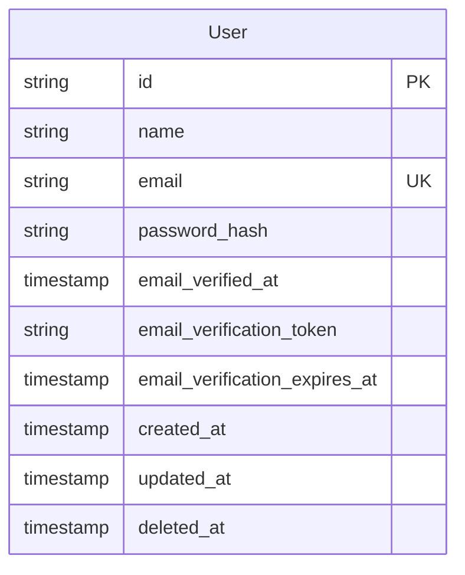

# Módulo de Usuarios (User Module)

Este módulo es el núcleo de gestión de identidad de la plataforma. Se encarga del ciclo de vida completo de los usuarios, desde el registro y la persistencia de perfiles hasta la seguridad de credenciales y el borrado lógico.

## 🚀 Arquitectura y Funcionalidades

El módulo sigue una arquitectura limpia de tres capas (Handler, Service, Repository):

* **Gestión de Perfil:** Permite a los usuarios autenticados obtener (`GetMe`) y actualizar (`UpdateMe`) su propia información.
* **Seguridad de Credenciales:** Implementa el hashing de contraseñas mediante **Bcrypt** con un factor de costo de 12 para garantizar una protección robusta.
* **Normalización de Datos:** Los correos electrónicos se limpian de espacios y se convierten a minúsculas antes de la persistencia para evitar duplicados por formato.
* **Borrado Lógico (Soft Delete):** Utiliza `gorm.DeletedAt` para desactivar cuentas sin eliminar los registros físicamente, permitiendo auditoría y evitando que el mismo email se reutilice inmediatamente.
* **Revocación de Sesiones:** Al eliminar un usuario, el servicio invoca automáticamente a un `TokenRevoker` para invalidar todos los *refresh tokens* activos del usuario.

---

## 📊 Modelo de Datos y Relaciones

El esquema de base de datos está diseñado para PostgreSQL a través de GORM.

### Tabla: `users`
| Campo | Tipo | Restricciones | Descripción |
| :--- | :--- | :--- | :--- |
| `id` | UUID | Primary Key | Generado automáticamente mediante UUID v4 antes de la creación. |
| `name` | String | Not Null | Nombre visible del usuario. |
| `email` | String | Unique Index | Identificador único para el inicio de sesión. |
| `password_hash`| String | Not Null | Hash Bcrypt (excluido de las respuestas JSON por seguridad). |
| `email_verified_at`| Timestamp| Nullable | Indica si el usuario ha completado la verificación de correo. |
| `deleted_at` | Timestamp | Index | Gestionado por GORM para el borrado lógico. |

### Relaciones del Modelo (ERD)
1.  **Auth Integration (1:N):** Aunque se gestiona en el módulo de Auth, existe una relación lógica donde un usuario posee múltiples tokens. El `Service` garantiza la integridad al limpiar estas sesiones mediante la interfaz `TokenRevoker`.
2.  **Verificación de Cuenta:** El modelo incluye campos de soporte para tokens de verificación y fechas de expiración, facilitando flujos de seguridad futuros.

El diagrama siguiente refleja **únicamente las entidades que define este módulo**. Los refresh tokens y sesiones pertenecen al módulo **Auth** (`RefreshToken` / tabla `refresh_tokens`).

---

## 🛠 Diccionario de Errores y Validaciones

El sistema responde con códigos de error estandarizados para facilitar la integración con el cliente:

| Código de Error | HTTP Status | Causa |
| :--- | :--- | :--- |
| `CodeUnauthorized` | 401 | El token de sesión no es válido o falta en el contexto. |
| `CodeUserNotFound` | 404 | El ID no existe o el formato UUID es inválido. |
| `CodeValidationError` | 422 | Los datos no cumplen con las reglas (ej. falta nombre o password en update). |
| `CodeEmailAlreadyExists`| 409 | Intento de registro con un email ya en uso (activo o borrado). |
| `CodeInvalidRequestBody`| 400 | El JSON enviado en el cuerpo de la petición es inválido. |

---

## 🛡 Consideraciones Técnicas

* **Middleware Requerido:** Los endpoints privados (`/me`) dependen del middleware `requestctx.UserOnly` para extraer el `UserID` de los locales de la petición de forma segura.
* **Validación de UUID:** El `Service` valida estructuralmente los IDs recibidos mediante `uuid.Parse` antes de consultar al repositorio para evitar consultas innecesarias a la DB.
* **Integridad de Unicidad:** El repositorio verifica la existencia del email mediante `Unscoped()`, asegurando que no se dupliquen correos incluso contra registros marcados como borrados.

---

## 🧪 Pruebas

El módulo incluye tests para el **modelo** y el **handler**:

* **Modelo (`model_test.go`):** Verificación de `SetPassword` (hashing Bcrypt) y `CheckPassword` (comparación segura).
* **Handler (`handler_test.go`):** Casos de éxito y error para `GetMe`, `CreateUser`, `UpdateMe` y `DeleteMe`: autorización, usuario no encontrado, validación de campos, email duplicado (incluyendo insensibilidad a mayúsculas) y revocación de sesiones en borrado.

Para ejecutar las pruebas del módulo desde la raíz del proyecto: `go test ./internal/user/...`